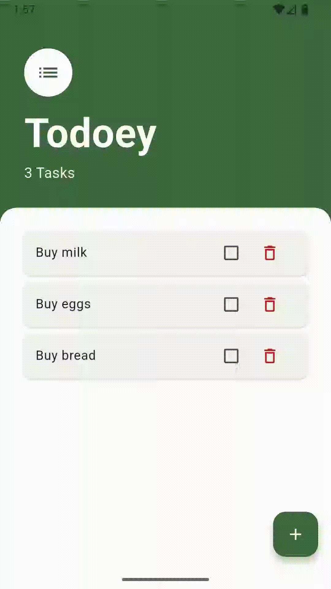
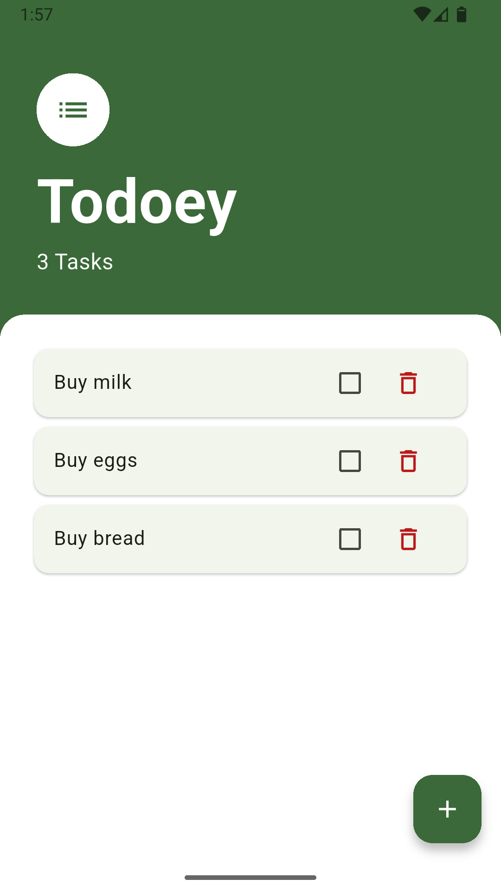
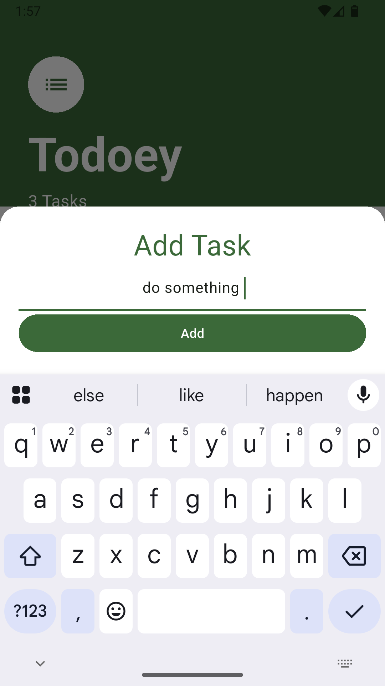

# 📝 Todoey App

# 📱 Demo
<p align="center">
	
    
    
</p>

A **task management application** developed in **Flutter** that allows users to create, organize, and manage daily tasks in a simple and intuitive way.

This project was built focusing on learning **state management, dynamic UI updates, component structuring, and clean architecture practices**, following Flutter development best practices.

---

## 📱 Features

- ✅ Add new tasks
- 🗑️ Delete tasks
- ✔️ Mark tasks as completed
- 🔄 Real-time UI updates
- 📋 Organized task list
- 🎨 Clean and minimal interface

---

## 🛠️ Technologies Used

- **Flutter**
- **Dart**
- **Stateful Widgets**
- **Custom Components**
- **Material Design**

---

## 📂 Project Structure
```
lib/
├── main.dart
├── screens/
│ └── tasks_screen.dart
├── widgets/
│ ├── task_tile.dart
│ ├── tasks_list.dart
│ └── add_task_screen.dart
├── models/
│ └── task.dart
└── constants.dart
```
